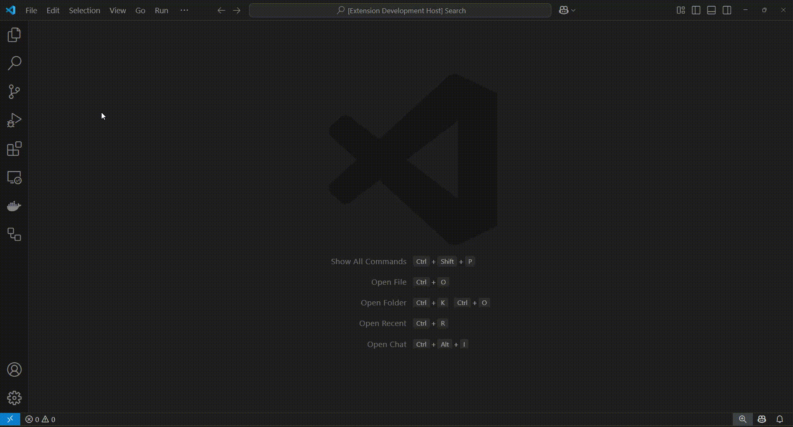
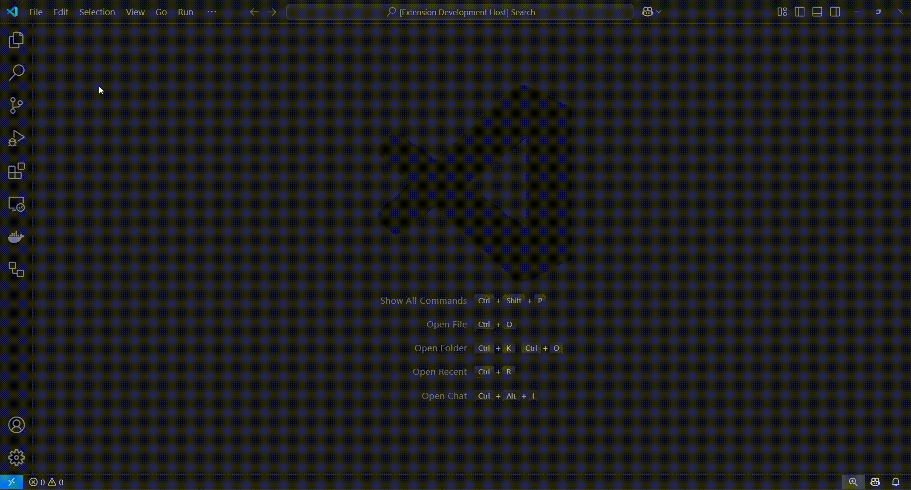

# sql-on-fhir-toolkit-vscode
A VS Code extension providing tools for validation and generation of content based on the [SQL on FHIR®2.0.0](https://sql-on-fhir.org/ig/2.0.0/) specification, using its [JavaScript Reference Implementation](https://github.com/FHIR/sql-on-fhir-v2).

## Features

### 1. Validating a View Definition instance
1.1. Open up a JSON file with the View Definition content;  
1.2. Using the Command Palette ("View/Command Palette..." or Ctrl+Shift+P), execute the command "sql-on-fhir-toolkit-vscode: Validate the View Definition instance";  
1.3. The validation result will be shown as a pop-up message in the bottom-right corner of the editor window.  

### 2. Generating DDL instructions for the View Definition instance
2.1. Open up a JSON file with the View Definition content;  
2.2. Using the Command Palette ("View/Command Palette..." or Ctrl+Shift+P), execute the command "sql-on-fhir-toolkit-vscode: Generate DDL for the View Definition instance";  
2.3. The DDL instructions will be shown in a new editor tab.  

### 3. Generating DML instructions for a dataset using a View Definition instance
3.1. Open up a dataset according to the [ndjson](https://github.com/ndjson/ndjson-spec) format in the editor's first tab;  
3.2. Open up a JSON file with the View Definition content in the editor's second tab;  
3.3. Using the Command Palette ("View/Command Palette..." or Ctrl+Shift+P), execute the command "sql-on-fhir-toolkit-vscode: Generate DML for the dataset";  
3.4. The DML instructions will be shown in a new editor tab.  

## Notes
The extension expects the JSON representation of a resource instance's content, not its XML or Turtle versions.

## Release Notes

### 1.0.0

- Initial release.
- All columns in the DDL and DML instructions are mapped to the SQL's CHARACTER VARYING data type.
